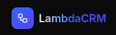

<p align="center">
  
</p>
<p align="center">
  <a href="https://nodejs.org/">
    
  </a>
  <a href="https://aws.amazon.com/">
    
  </a>
  <a href="https://reactjs.org/">
    
  </a>
  <a href="https://www.typescriptlang.org/">
    
  </a>
</p>

<p align="center"><b>LambdaCRM</b> is a lightweight, serverless CRM powered by AWS, designed to help teams effortlessly manage leads, clients, deals, and tasks.</p>

## 🏗️ Architecture

- **Backend**: TypeScript Lambda function with API Gateway
- **Frontend**: React with Vite, TailwindCSS, and ShadeCN UI components
- **Database**: DynamoDB with single-table design
- **Authentication**: AWS Cognito
- **Infrastructure**: AWS CDK
- **Local Development**: docker compose with LocalStack

## 📁 Project Structure

```
lambdacrm/
├── backend/           # Lambda function and API logic (Internally routes within a single Lambda)
│   ├── src/
│   │   ├── controllers/   # Internal route handlers
│   │   ├── lib/           # Core lib
│   │   ├── models/        # Entities
│   │   ├── repositories/  # Data access layer
│   │   ├── schemas/       # Zod validation schemas
│   │   └── services/      # Business logic
│   │   └── types/         # Typescript types
│   └── package.json
├── frontend/          # React frontend application
│   ├── src/           # React components and pages
│   └── package.json
├── cdk/              # AWS CDK infrastructure code
│   ├── lib/          # CDK stack definitions
│   └── package.json
└── docker-compose.local.yml # Local development services
```

## 🚀 Deployment

### AWS Deployment

1. **Configure AWS credentials**
   ```bash
   aws configure
   ```

2. **Bootstrap CDK (first time only)**
   ```bash
   cd cdk
   cdk bootstrap
   ```

3. **Build and deploy**
   ```bash
   node cdk-deploy.js
   ```

## 🤝 Contributing

1. Fork the repository
2. Create a feature branch (`git checkout -b feature/amazing-feature`)
3. Commit your changes (`git commit -m 'Add some amazing feature'`)
4. Push to the branch (`git push origin feature/amazing-feature`)
5. Open a Pull Request

## 📄 License

This project is licensed under the MIT License - see the [LICENSE](LICENSE) file for details.
